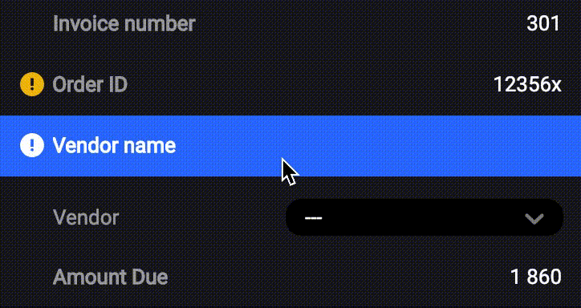

# Example Python Rossum Webhook

This example webhook:
  * Normalizes invoice id to contain only numbers
  * Warns if order id is not in a particular (six digit) format
  * Matches vendor against a vendor list (toy list containing vendors "Roboyo", "Rossum", "Volvo")

To set up the extension, see our [Developer Hub guide](https://developers.rossum.ai/docs/run-extension-microservice).
